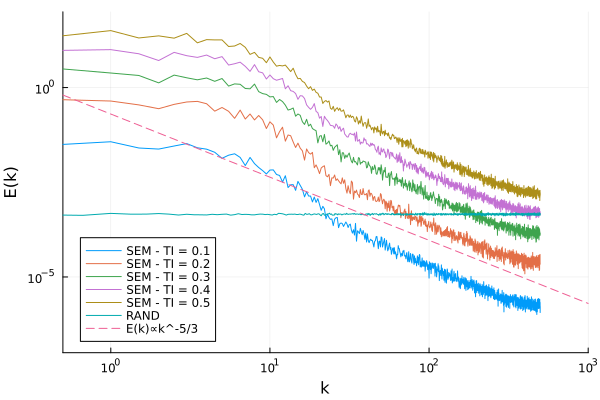
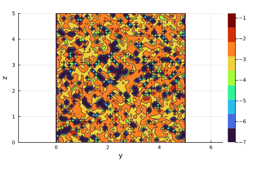

# Summary
The Synthetic Eddy Method (SEM) is a numerical simulation technique used to create a turbulent flow field with desired features. It is used in computational fluid dynamics for imposing realistic inlet boundary conditions, improving the fidelity of the results obtained by simulations. Its ability to create fluctuations with prescribed physical features makes it a valuable tool for researchers and engineers seeking to improve the reliability of simulations and also for re-creating as much as possible an environment close to an experimental one. The package allows users to easily generate synthetic turbulence fields that can be used in CFD simulations, and to control the level of turbulence and length-scales of the eddies in the generated fields.

# Statement of need

`SyntheticEddyMethod.jl` is a package which aims to create realistic turbulent inlet conditions for Large Eddy Simulations. This package will be a valuable tool for researchers and engineers working in the field of Computational Fluid Dynamics, offering an intuitive and efficient way to simulate proper boundary conditions. The fluctuations generated are more realistic than those that can be easily produced by a random signal.

The method has been originally introduced by @Jarrin:2006. It is based on the idea of eddies randomly created inside a virtual box, where no dissipative effects occur. These are convected at every time-step. Each eddy influences its surroundings based on its dimension and the chosen kernel (or shape) function. It has been extended by @Poletto:2013, implementing the divergence-free (DFSEM) constraint to obtain fluctuations for incompressible flows, which are the most common cases studied for turbulence.

`SyntheticEddyMethod.jl` is completely implemented in the Julia programming language [@Bezanson:2017]. In recent years, Julia has emerged as a powerful language for scientific computing and has become popular among researchers and practitioners in the field of fluid dynamics. Julia is extremely expressive and allows one to condense complex mathematical expressions into a few syntactic lines. The functions are written almost identically as on paper. This also has an advantage for people who desire to contribute and use it. By taking advantage of the flexibility of Julia's multiple dispatch, it allows users to simulate fluctuations at specific points in the flow field or at multiple points simultaneously, offering a powerful optimized tool. Users can customize several key parameters of the SEM method, such as the turbulence intensity, Reynolds stress, and eddy dimensions. These parameters can be set by the user directly, or loaded from a file, making the package versatile and user-friendly.

Different software packages have been developed to implement this method (for example, using Fortran, @OH:2019). However, these packages are often limited in their applicability and can be challenging for non-experts to use. `SyntheticEddyMethod.jl` is designed to be more general-purpose, allowing it to be applied to a broader range of turbulence simulation problems. It is designed to be more accessible and with clear documentation.

## Results
{ width=45% }
{ width=45%  }

# Package Features
- Create velocity fluctuations for inlet boundary conditions
- Create fluctuations that respect the divergence-free condition (DFSEM)
- Create coherenteddies in a 3D domain
- It can simulate anisotropic effects by allowing the eddies to have different dimensions along different directions
- Define a custom Reynolds Stress Tensor
- Import custom Reynolds Stress Tensor

# References
